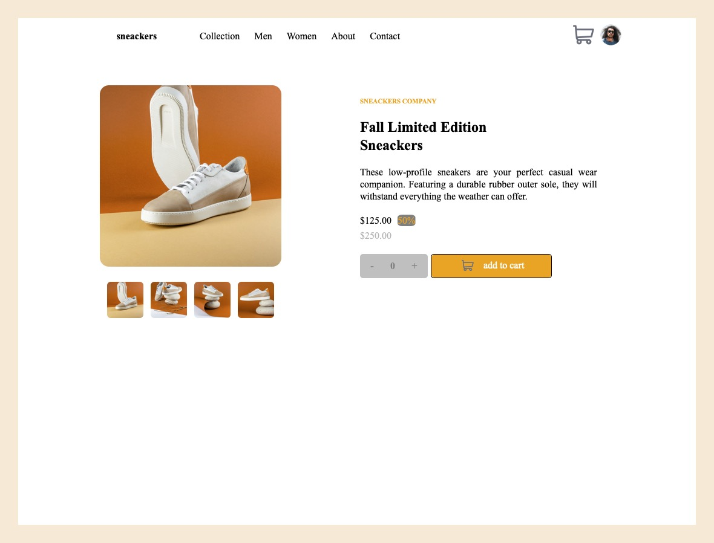

# Frontend Mentor - E-commerce product page solution

This is a solution to the [E-commerce product page challenge on Frontend Mentor](https://www.frontendmentor.io/challenges/ecommerce-product-page-UPsZ9MJp6).

## Table of contents

- [Overview](#overview)
  - [The challenge](#the-challenge)
  - [Screenshot](#screenshot)
  - [Links](#links)
- [My process](#my-process)
  - [Built with](#built-with)
  - [What I learned](#what-i-learned)
  - [Continued development](#continued-development)
  - [Useful resources](#useful-resources)
- [Author](#author)
- [Acknowledgments](#acknowledgments)


## Overview

This is my final project on Frontend Web Coding & Developement. On this project you will notice how hard I tried to replicate the origal project - its design and behavour. 
I started with bootstrap framework but I realised I would not be able to show my skills, everything that I learnt on course so far. I had to make an
important decision, should I carry on with bootstrap or just pure HTMl, CSS and Javascript! 

### The challenge

Users should be able to:

- View the optimal layout for the site depending on their device's screen size
- See hover states for all interactive elements on the page
- Open a lightbox gallery by clicking on the large product image
- Switch the large product image by clicking on the small thumbnail images
- Add items to the cart
- View the cart and remove items from it

### Screenshot



### Links

- [gitHub] (https://github.com/LeviDomingos/E-Commerce) - Project 
- [Live Page] (https://levidomingos.github.io/E-Commerce/) - Live gitHub Page

## My process
 1. Started by downloading the entire project from learning people to my laptop
 2. Looked at the entire project first, thought how to go about it
 3. Created the folder on github
 4. Decided to use Visual Studio Code
 5. I followed the sugestion - working from the top to the bottom, one task at time and making sure that was happy with it before moving to a different task

### Built with

- Semantic HTML5 markup
- CSS custom properties
- Flexbox
- CSS Grid
- Mobile-first workflow
- [JavaScript](https://developer.mozilla.org/en-US/docs/Web/JavaScript) - JS library


### What I learned

The most rewarding part of the project was the LightBox design. Being able to achive it is a milestone indeed.   

To see how you can add code snippets, see below:

```html
 <div id ="idActivateStatesLightBox" class="hideAnyElement">
   <div class ="squareLightBox">
     <div id="idCloseLightBox" class="closeLightBox"> </div>
     
     
     <div class="imgButtonsLightBox">
       <div data-cell-index="1" class="lightBoxPreviewsImg classLightBox"></div>
       <div data-cell-index="2" class="lightBoxNextImg classLightBox"></div>
     </div>
     <div class="thumbnailLightBox">
       <div></div>
       <div></div>
       <div></div>
       <div></div>
     </div>
   </div>
   
 </div>
```

```css
/* lightbox section starts here, all the classes associated with it are here from 160 to 259*/
.lightBoxPicture {
    cursor: pointer;
    position: fixed;
    z-index: 2;
    width: 100vw;
    min-height: 100vh;
    left: 0px;
    right: 0px;
    top: 0px;
    background: rgba(0, 0, 0, 0.6);
}

.squareLightBox {
    justify-content: center;
    position: absolute;
    width: 500px;
    height: 500px;
    z-index: 2;
    top: 10%;
    left: 0;
    right: 0;
    margin: auto;

}

.squareLightBoxMainImg{
    position: absolute;
    z-index: 2;
    width: 450px;
    height: 450px;
    margin:auto;
    top:0;
    left:0;
    right:0;
    bottom:0;
    border-radius: 10px;
}

.closeLightBox {
    position:absolute;
    right: 25px;
    top: -5px;
    color: white;
}

.closeLightBox:hover {
    color: orange;
}

.closeLightBox::after {
    content: "\00d7";
    font-weight: bold;
    font-size: 30px;
}

.imgButtonsLightbox {
    z-index: 2;
    display: inline-block;
}
.lightBoxPreviewsImg::after {
    content: "\003c";
    font-size: 30px;
    font-weight: bold;
}

.lightBoxNextImg::after {
    content: "\003e";
    font-size: 30px;
    font-weight: bold;
}

.imgButtonsLightBox .lightBoxPreviewsImg {
    position: absolute;
    left: 2px;
}

.lightBoxNextImg, .lightBoxPreviewsImg {
    background-color:white;
    border: 2px solid white;
    height: 50px;
    width: 50px;
    border-radius: 50%;
    color: black;
    text-align: center;
    line-height: 40px;
    top: 230px;
    z-index: 2;
}

.imgButtonsLightBox .lightBoxNextImg {
    position: absolute;
    right: 2px;
}

.thumbnailLightBox {
    grid-template-columns: 20% 20% 20% 20%;
    display: grid;
    justify-content: space-evenly;
    position: absolute;
    height: 100px;
    width: 450px;
    z-index: 2;
    top: 500px;
    left: 5%;
    right: 5%;
}

.fourLightBoxImgs {
    display: flex;
    width: 90px;
    height: 90px;
    border-radius: 10px;
}
.fourLightBoxImgs:hover {
    border: 2px solid orange;
}

/*lightbox ends here */
```

```js
 //this function shows the pictuires in the main image and lightbox too
 function displayLightBoxPicture(event) {
     const cellValue = event.target;
     const cellIndex = parseInt(cellValue.getAttribute("data-cell-index"));
     if(cellIndex === 1 && showPicture > 1) {
         --showPicture;
         document.getElementById("idSquareLightBoxMainImg").src = "static/images/image-product-" + showPicture + ".jpg";
     }
     if(cellIndex === 2 && showPicture <= 3) {
         ++showPicture;
         document.getElementById("idSquareLightBoxMainImg").src = "static/images/image-product-" + showPicture + ".jpg";
     }
     if(cellIndex === 3 && showPicture > 1 ) {
         --showPicture;
         document.getElementById("idMainImg").src = "static/images/image-product-" + showPicture + ".jpg";
     }
     if(cellIndex === 4 && showPicture <= 3) {
         ++showPicture;
         document.getElementById("idMainImg").src = "static/images/image-product-" + showPicture + ".jpg";
     }
 }
```

### Continued development

I would like to learn how to use class in JavaScript, the OOP approach. 

I want to use Canvas effectively.

One of the things that I struggle with is make functions more re-usable through the project, learn how to create re-usable function. 

### Useful resources

- [Developer Mozilla](https://developer.mozilla.org/en-US/) - This helped me to understand how flexbox works and the grid system too. True source of Frontend information indeed. 
- [CSS Tricks](https://css-tricks.com) - This is an amazing article which helped me finally understand css. I'd recommend it to anyone still learning frontend.
- [w3schools](https://www.w3schools.com) - I think that every one heard and knows about w3schools! I find it very helpful when come to Semantic HTML5. 
[stackoverflow Community](https://stackoverflow.com) - Here is whre the biggest tech community lives &#65; &#66; &#67;


## Author

- Website - [Levi Domingos](https://levidomingos.github.io/E-Commerce/)
- Frontend Mentor - [@Alex Ford ]()

## Acknowledgments

To my mentor Alex Ford, a great thank you for your help and patience above all for your guidance. Because of you I started buying I.T books again, something that gave up many many years ago. 

I bought two books, a Frontend book by Paul McFedriess and JavaScript by  
